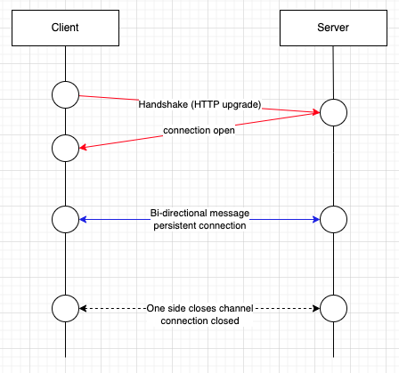

# Server Sent Event Basic Concept

## Server-Client 커뮤니케이션 방식 

- Server와 Client 상호간 통신을 수행하는 방식에는 2가지 카테고리가 존재한다. 
- Client가 Server에 요청을 보내고 응답을 가져가는 Client Pull 방식이 있고, 
- Server가 Client에 이벤트를 전송하는 Server Push 방식이 있다. 
- Client --> Server 방식과 Server --> Client 방식을 하나하나 알아보고, ServerSendtEvent 가 출시된 이유를 생각해 볼 수 있다.

## Client Pull 방식 

- Client Pull 방식은 클라이언트가 주기적으로 서버에 요청을 보내서 응답 결과를 받아가는 방식이다. 
- 서버는 요청을 받으면 클라이언트에 응답을 보내고 커넥션을 종료하는 방식이다.
- 여기에는 Short Polling 과 Long Polling 2가지 방식이 존재한다. 
  
### Short Polling

- Short Polling 은 주기적으로 클라이언트가 서버로 요청을 보낸다. 
- 만약 서버가 변경사항이 있으면 클라이언트에 응답을 보내고, 커넥션을 종료한다. 
- 변경사항이 존재하지 않으면 특정 값을 반환하고 바로 커넥션을 종료한다. 
  

- 위 그림과 같이 변경이 발생하든, 발생하지 않든 서버는 커넥션을 바로 끊어 버린다. 

#### 특징

- 구조가 단순한 장점이 있다.
- 응답을 빠르게 수행할 수 있다면 준 실시간 성을 반영할 수 있는 방식이다. 
- 그러나 요청에 대한 응답이 빠르지 않다면 서버로 요청이 계속해서 밀리면서 서버 부하를 줄 수 있다. 

### Long Polling

- Long Polling 역시 주기적으로 클라이언트가 서버로 요청을 보낸다. 
- 서버에 요청을 보내면, 서버는 변경사항이 발생할 때 까지 커넥션을 유지했다가, 변경이 발생하면 클라이언트에 변경사항을 반환하고, 커넥션을 바로 종료한다. 
- 서버가 변경사항이 발생하지 않으면 일정시간 클라이언트의 커넥션을 유지하다가 시간이 되면 특정 메시지클 클라이언트에 보내고 커넥션을 바로 종료한다. 

- 위 그림과 같이 클라이언트가 서버에 커넥션을 걸고 변경사항을 요청한다. 
- 서버는 변경사항이 발생하기 전까지 연결을 유지하다가, 변경발생 (파란색 원)이 되면 결과를 반환하고 커넥션을 종료한다. 
- 서버의 변경사항이 존재하지 않는경우 타임아웃까지 대기하다가, 타임아웃이 되면 커넥션을 종료한다. 

#### 특징

- 서버의 상태가 빈번하지 않는 경우 적합하다. 매번 커넥션을 요청하지 않아도 되는 서비스가 적합하다. 
- 서버의 변경사항이 빈번하다면, 연결요청도 늘어나고, 서버 부하가 발생할 수 있다. 

## Server Push 방식 

- Server Push 는 서버가 사전에 메시지를 클라이언트로 발생 즉시 전달하는 방식이다. 
- 이 방식은 실시간성이 매우 뛰어난 방식이다. 
- 여기에는 WebSocket과 Server-Sent Events 방식이 있다. 

### WebSocket

- 웹 소켓은 동시에 양방향으로 실시간 통신을 할 수 있는 웹 애플리케이션 기술이다. 
- 웹 소켓은 기본적으로 HTTP 프로토콜 위에서 동작한다.
- 양방향 실시간성 처리가 필요하다면 WebSocket을 고려해볼 수 있다. 

- 위 그림과 같이 웹 소켓이 동작한다.
  - 1. Handshake: 클라이언트 요청으로 서버와 커넥션을 맺는다. 
  - 2. Bi-direction communication: 양뱡향으로 메시지를 주고/받을 수 있다. 
  - 3. Connection Close: 한쪽에서 커넥션을 끊으면 커넥션이 종료된다. 

- 특징
  - 웹 소켓은 실시간, 양방향 통신이 필요한경우 매우 유용하다. 
  - 웹 소켓 개발에 대한 부담이 있다. 
    - 케넥션 유지, 전환 등
    - 메시지 재전송 등에 대한 처리 등

### Server Sent Event

- Server Sent Event는 이름 그대로 커넥션을 맺고 나서, 서버가 클라이언트로 단방향 메시지 푸시를 수행한다. 

- 위 그림과 같이 SSE는 다음과정으로 통신이 수행된다. 
  - 1. 클라이언트가 서버로 커넥션 연결을 수행한다. 
  - 2. 서버는 연결된 클라이언트 세션으로 메시지를 push 한다. 
  - 3. 오직 서버에서 클라이언트로만 메시지가 전송될 수 있다. 
  - 4. 전송되는 메시지는 단순 text만 가능하다. 

## Wrap

- 클라이언트가 서버의 변경사항을 조회하는 방법에 대해서 알아보았다. 
- 클라이언트 풀 방식은 Short-Polling, Long-Polling 2가지 방식이 있다. 
- 서버 푸시 방식은 WebSocket, Server-Sent Events 2가지 방식이 있다. 
- 각각의 방식이 가지는 특징에 대해 알아 보았으며, 요구사항에 따라 기술을 선택할 수 있다. 