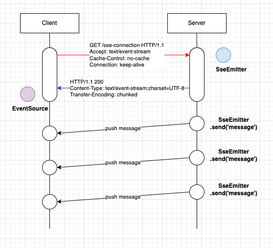

# Simple Server Sent Event

- Server Sent Event 는 서버와 커넥션을 우선 요청하게 된다. 
- 다음은 Server-Sent Events의 동작방식을 설정했다. 



## Server에 Subscribe 하기

- 클라이언트는 서버에 SSE 커넥션을 맺고 Subscribe 등록을 한다. 
- 이때 헤더에 요청 정보를 실어 서버로 전송한다. 

```go
GET /sse-connection HTTP/1.1
Accept: text/event-stream
Cache-Control: no-cache
Connection: keep-alive
```

- Accept: text/event-stream
  - 이벤트 스트림 미디어 타입을 요청한다. 
- Cache-Control: no-cache
  - 이벤트 캐싱을 disable 한다. 
- Connection: keep-alive
  - 커넥션은 keep-alive로 설정하여, 커넥션이 지속적으로 유지되도록 한다. 

## Subscribe에 대한 Server 응답 정보 

- 클라이언트 요청에 대해서 정상적으로 서비스 가능한경우 다음 응답을 보낸다. 

```go
HTTP/1.1 200
Content-Type: text/event-stream;charset=UTF-8
Transfer-Encoding: chunked
```

- Content-Type: text/event-stream;charset=UTF-8
  - 컨텐츠 타입으로 text/event-stream 미디어 타입을 내려 보낸다. 
  - 또한 캐릭터셋은 UTF-8 로 지정한다. 
- Transfer-Encoding: chunked
  - chunked 의미는 서버 스트림이 동적으로 컨텐츠 내용을 생성하여 전송하므로 컨텐츠의 크기를 알수 없음을 나타낸다. 

- 서버가 생성이 되면 SseEmitter 객체가 생성이 되며, 이객체는 클라이언트를 식별할 수 있는 세션을 나타낸다. 
- SseEmitter을 통해서 메시지를 push할 수 있다. 
   
## 메시지 push 하기 

- SseEmitter을 통해서 클라이언트로 메시지를 push 할 수 있다. 
- 메시지는 오직 text 메시지만 가질 수 있으며 UTF-8로 인코딩 된다. 
- 이벤트는 각각 '\n\n'으로 구분된다. 
- 각 서로다른 이벤트는 하나 혹은 여러개의 'name: value'쌍으로 구성이 되며, 각 필드들은 단일 '\n'으로 구분된다. 

<br/>

- 다음은 서로다른 이벤트 2개가 각각 전달된 경우이다. 

```go
data: The first event.

data: The second event.
```

- 다음은 하나의 이벤트에 여러개의 필드들로 구성된 데이터이다. 

```go
data: The third
data: event.
```

- 다음은 'id' 라는 예약어를 통해서 유니크한 이벤트 식별자를 전송하는 예이다. 
- 만약 커넥션이 깨지면 클라이언트는 다시 연결을 수행하고,  Last-Event-ID 헤더와 함께 마지막으로 받은 이벤트 id를 보내야한다. 

```go
id: 1
data: The first event.

id: 2 
data: The second event.
```

- 다음 'event' 필드는 서버에서 원하는 다른 타입의 이벤트를 클라이언트에 전송할 수 있고, 클라이언트는 이 타입을 이용하여 적절한 처리를 수행할 수 있다. 

```go
event: type1
data: An event of type1.

event: type2
data: An event of type2.

data: An event without any type.
```

- 'retry' 필드에서 서버는 시간제한(밀리초)를 보낼 수 있다. 이후 연결이 끊어지면 클라이언트는 자동적으로 재시도 해야한다. 
- 만약 필드가 지정되지 않으면 기본값은 3000 밀리초(3초) 가 된다. 

```go
retry: 1000
```

- 행이 ':' (콜론) 으로 시작하면 클라이언트에서 무시해야한다. 
- 이것은 서버가 커멘트를 보냈거나 혹은 일부 프록시 서버가 시간 초과로 연결을 닫는 것을 방지하기 위한 용도로 사용하는 것이다 .

```go
: ping
```

## 한계점

- SSE는 설계상 한계가 존재한다. 
  - 메시지는 오직 한방향 (서버 --> 클라이언트) 로만 전송이 가능하다. 
  - 오직 텍스트 메시지(UTF-8 encoding) 으로만 전송이 가능하다. Base64혹은 gzip 압축을 전송할 수 있지만 이로인한 효과는 없다. 
  - 인터넷 Explorer/Edge 와 많은 모바일 브라우저는 SSE를 지원하지 않는다. 그럼에도 불구하고 polyfills를 이용할 수 있지만 효과는 크지않다.
  - 많은 브라우저들은 매우 제한된 수의 SSE커넥션만을 열수 있도록 허용한다. (Chrome, Firefox 등은 각 브라우저당 6개 커넥션 정도가능)
  
## WrapUp

- 지금까지 기본적인 Server Sent Event 가 통신하는 방식을 디테일하게 알아 보았다. 
- 클라이언트는 서버에 event-stream을 요청하고, 서버는 응답으로 event-stream을 반환한다. 
- 서버는 클라이언트로 오직 텍스트만을 전송할 수 있다. 
- 이벤트 구분, id, event, retry, ':' 등을 통해서 별도의 제어를 수행할 수 있다. 
- 제공되는 브라우저 정보 (EventSource 지원범위: https://caniuse.com/#feat=eventsource)

## 참고

- https://github.com/aliakh/demo-spring-sse
- https://grapeup.com/blog/how-to-build-real-time-notification-service-using-server-sent-events-sse/