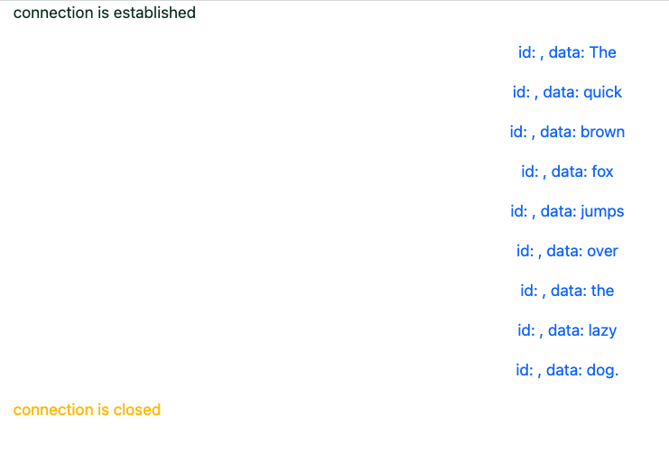

# SSE Basic Client Application 개발 

- 클라이언트는 JavaScript 내에서 EventSource 라는 라이브러리를 이용한다. 
- 해당 EventSource 를 어떻게 사용할지, 이벤트에 대해서 어떠한 처리를 수행할 수 있는지 알아보자. 

- 최종 결과는 다음과 같다. 



## HTML 기본작성하기 (Bootstrap)

- html 을 위해서 bootstrap을 사용한다. 

```html
<!DOCTYPE html>
<html>
<head>
    <meta charset="utf-8">
    <meta name="viewport" content="width=device-width, initial-scale=1">
    <title>Server Sent Event 테스트 클라이언트</title>
    <link href="https://cdn.jsdelivr.net/npm/bootstrap@5.3.1/dist/css/bootstrap.min.css" rel="stylesheet" integrity="sha384-4bw+/aepP/YC94hEpVNVgiZdgIC5+VKNBQNGCHeKRQN+PtmoHDEXuppvnDJzQIu9" crossorigin="anonymous">
</head>
<body>
    <script ...>
    <div class="container">
        <div class="row">
            <div class="col" id="text-item">

            </div>
        </div>
    </div>

    <script src="https://cdn.jsdelivr.net/npm/@popperjs/core@2.11.8/dist/umd/popper.min.js" integrity="sha384-I7E8VVD/ismYTF4hNIPjVp/Zjvgyol6VFvRkX/vR+Vc4jQkC+hVqc2pM8ODewa9r" crossorigin="anonymous"></script>
    <script src="https://cdn.jsdelivr.net/npm/bootstrap@5.3.1/dist/js/bootstrap.min.js" integrity="sha384-Rx+T1VzGupg4BHQYs2gCW9It+akI2MM/mndMCy36UVfodzcJcF0GGLxZIzObiEfa" crossorigin="anonymous"></script>

</body>
</html>
```

- 위와 같이 bootstrap 을 이용하기 위한 설정을 했다. 
- bootstrap 설정은 [다음내용](https://getbootstrap.com/docs/5.3/getting-started/introduction/) 을 살펴보자. 

## EventSource 사용하기 

- SSE를 javascript를 이용하기 위해서 다음과 같은 형태로 작업이 된다. 

```js
    <script>
        if (window.EventSource == null) {
            const text = 'The browser does not support Server-Sent Events';
            alert(text);
            const elem = document.getElementById('text-item');
            const newP = document.createElement("p");
            newP.setAttribute('class', 'text-start text-secondary')
            newP.appendChild(document.createTextNode(text));
            elem.appendChild(newP);
        } else {
            var eventSource = new EventSource('/words');

            eventSource.onopen = function () {
                const text = 'connection is established';
                console.log(text);

                const elem = document.getElementById('text-item');
                const newP = document.createElement("p");
                newP.setAttribute('class', 'text-start text-success-emphasis')
                newP.appendChild(document.createTextNode(text));
                elem.appendChild(newP);
            };

            eventSource.onerror = function (error) {
                const text = 'connection state: ' + eventSource.readyState + ', error: ' + event;
                console.log(text);

                const elem = document.getElementById('text-item');
                const newP = document.createElement("p");
                newP.setAttribute('class', 'text-start text-danger')
                newP.appendChild(document.createTextNode(text));
                elem.appendChild(newP);
            };

            eventSource.onmessage = function (event) {

                const text = 'id: ' + event.lastEventId + ', data: ' + event.data;
                console.log(text);

                const elem = document.getElementById('text-item');
                const newP = document.createElement("p");
                newP.setAttribute('class', 'text-center text-primary')
                newP.appendChild(document.createTextNode(text));
                elem.appendChild(newP);

                if (event.data.endsWith('.')) {
                    eventSource.close();

                    const text = 'connection is closed';
                    console.log(text);

                    const elem = document.getElementById('text-item');
                    const newP = document.createElement("p");
                    newP.setAttribute('class', 'text-start text-warning')
                    newP.appendChild(document.createTextNode(text));
                    elem.appendChild(newP);
                }
            };
        }
    </script>
```

- ```if(window.EventSource == null)``` 
  - 현재 브라우저가 SSE를 이용할 수 있는지 검사한다. 
  - 사용할 수 없다면 null을 반환하게 될 것이다. 
- ```var eventSource = new EventSource('/words');```
  - EventSource 로 subscribe 하기 위해서 '/worlds' 경로로 잡는다. 
  - 이렇게 되면 EventSource 객체가 생성이 된다. 
- ```eventSource.onopen = function ()``` 
  - 커넥션이 연결이 되면 이벤트가 발생된다. 
- ```eventSource.onerror = function (error)```
  - 서버에서 오류가 발생한경우 해당 이벤트가 연결된다. 
- ```eventSource.onmessage = function (event)```
  - 정상적으로 서버에서 메시지가 들어온경우 해당 이벤트가 연결된다. 
- ```event.data.endsWith(.)```
  - 메시지가 . 으로 끈나는 경우 커넥션을 종료한다. 
  - 이때 'eventSource.close()' 를 통해서 커넥션 종료가 수행된다.

## 테스트


- 위와 같이 화면을 갱신하면 푸시 이벤트를 받고 결과가 출력된다. 

## WrapUp

- HTML 에서 JavaScript를 이용하는 경우 EventSource라이브러리를 이용한다. 
- 커넥션이 연결되거나, 메시지가 들어온경우, 오류가 발생한경우에 따라 이벤트를 받고, 각각 해당 처리를 수행할 수 있는 것을 알 수 있다. 